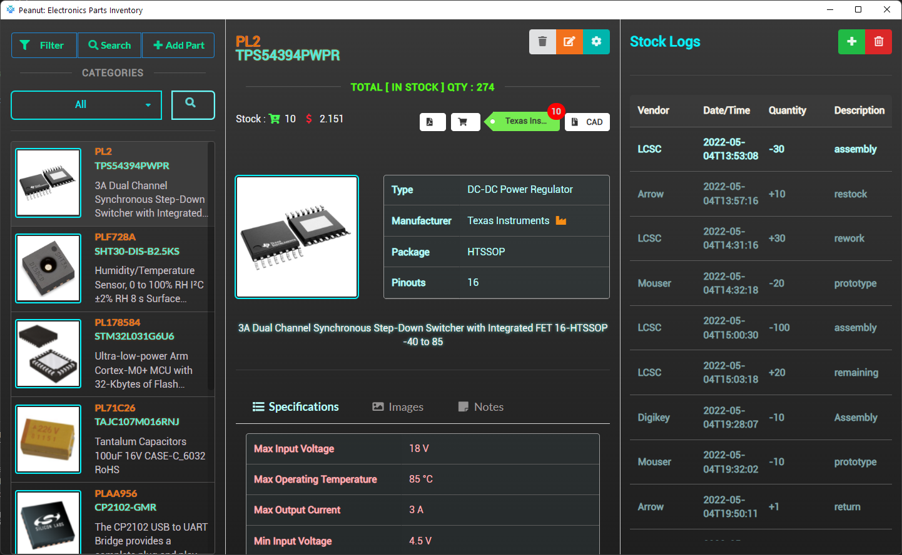

<div id="top"></div>
<!-- PROJECT LOGO -->
<br />
<div align="center">
    <h3 align="center">Personal Electronics Parts Inventory</h3>
  <a href="https://github.com/muchirijohn/inventory">
    
  </a>

  

  <p align="center">
    An awesome app to store your personal electronics parts and manage inventory with ease.
</div>


<!-- TABLE OF CONTENTS -->
<details>
  <summary>Table of Contents</summary>
  <ol>
    <li>
      <a href="#about-the-project">About The Project</a>
      <ul>
        <li><a href="#built-with">Built With</a></li>
      </ul>
    </li>
    <li>
      <a href="#getting-started">Getting Started</a>
      <ul>
        <li><a href="#prerequisites">Prerequisites</a></li>
        <li><a href="#installation">Installation</a></li>
      </ul>
    </li>
    <li><a href="#running">Usage</a></li>
    <li><a href="#contributing">Contributing</a></li>
    <li><a href="#license">License</a></li>
    <li><a href="#contact">Contact</a></li>
    <li><a href="#acknowledgments">Acknowledgments</a></li>
  </ol>
</details>


<!-- ABOUT THE PROJECT -->
## About The Project
Am a mechatronics engineer by profession, however i have been coding since i was 13 years old. I own a small electronics manufacturing lab and finding an inventory app for my parts has been a long time problem.

There are many great Inventory apps available either open source or commercial; however, I didn't find one that really suited my needs so I created this enhanced one. I want to create an inventory app thats simple, customizable and easier for your awesome lab inventory -- I think this is it.

Here's why:
* A project that solves a problem and helps others
* Its simple and easily customizable to suit your needs.
* Its open source :smile:

Of course, no one app will serve all and your needs may be different. So I'll be adding more features in the near future if time and resources allow. You may also suggest changes by forking this repo and creating a pull request or opening an issue.

Enjoy.

<p align="right">(<a href="#top">back to top</a>)</p>


### Built With

This project is built with this great frameworks and libraries.

* [Node Js](https://nodejs.org/en/)
* [Electron](https://www.electronjs.org/)
* [Semantic Ui](https://semantic-ui.com/)
* [Sqlite3](https://www.npmjs.com/package/sqlite3)
* [Jquery](https://jquery.com/)
* [Moment Js](https://momentjs.com/)
* [SweetAlert](https://sweetalert.js.org/)
* ...and many more.

<p align="right">(<a href="#top">back to top</a>)</p>


<!-- GETTING STARTED -->
## Getting Started

### Prerequisites

Always get the latest libraries.
* npm
  ```sh
  npm install npm@latest -g
  ```

### Installation

_Installations steps._

1. Download and install node [https://nodejs.org/en/](NodeJs)
2. (_optional_) Download [https://desktop.github.com/](github desktop). It makes things easier especially if it's your first time using git
2. Clone the repo
   ```sh
   git clone https://github.com/muchirijohn/inventory
   cd inventory
   ```
3. Install NPM packages - Dependencies
   ```sh
   npm install
   ```

<p align="right">(<a href="#top">back to top</a>)</p>


<!-- USAGE EXAMPLES -->
## Running
Run this command from inside inventory
```sh
   npm run start
   ```

<p align="right">(<a href="#top">back to top</a>)</p>

<p align="right">(<a href="#top">back to top</a>)</p>


<!-- CONTRIBUTING -->
## Contributing

Contributions are what make the open source community such an amazing place to learn, inspire, and create. Any contributions you make are **greatly appreciated**.

If you have a suggestion that would make this better, please fork the repo and create a pull request. You can also simply open an issue with the tag "enhancement".
Don't forget to give the project a star! Thanks again!

1. Fork the Project
2. Create your Feature Branch (`git checkout -b feature/AmazingFeature`)
3. Commit your Changes (`git commit -m 'Add some AmazingFeature'`)
4. Push to the Branch (`git push origin feature/AmazingFeature`)
5. Open a Pull Request

<p align="right">(<a href="#top">back to top</a>)</p>


<!-- LICENSE -->
## License

Distributed under the MIT License. See `LICENSE.txt` for more information.

<p align="right">(<a href="#top">back to top</a>)</p>


<!-- CONTACT -->
## Contact

[@muchiri15john](https://twitter.com/muchiri15john) - muchiri.mwihaki@gmail.com

[https://github.com/muchirijohn/inventory](https://github.com/muchirijohn/inventory)

<p align="right">(<a href="#top">back to top</a>)</p>


<!-- ACKNOWLEDGMENTS -->
## Acknowledgments

credits to:
* My partner in making <a href="https://twitter.com/ngoirimercy" target="_blank">@ngoirimercy</a>. She is the inspiration behind this project for our lab and she tests every commit.

<p align="right">(<a href="#top">back to top</a>)</p>
